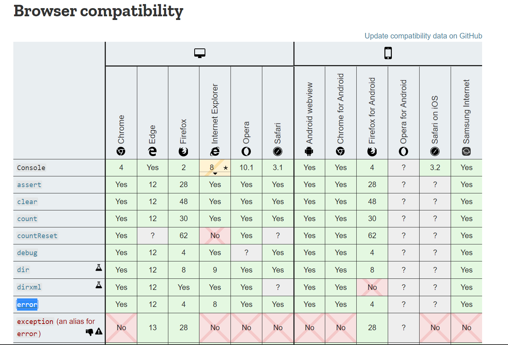
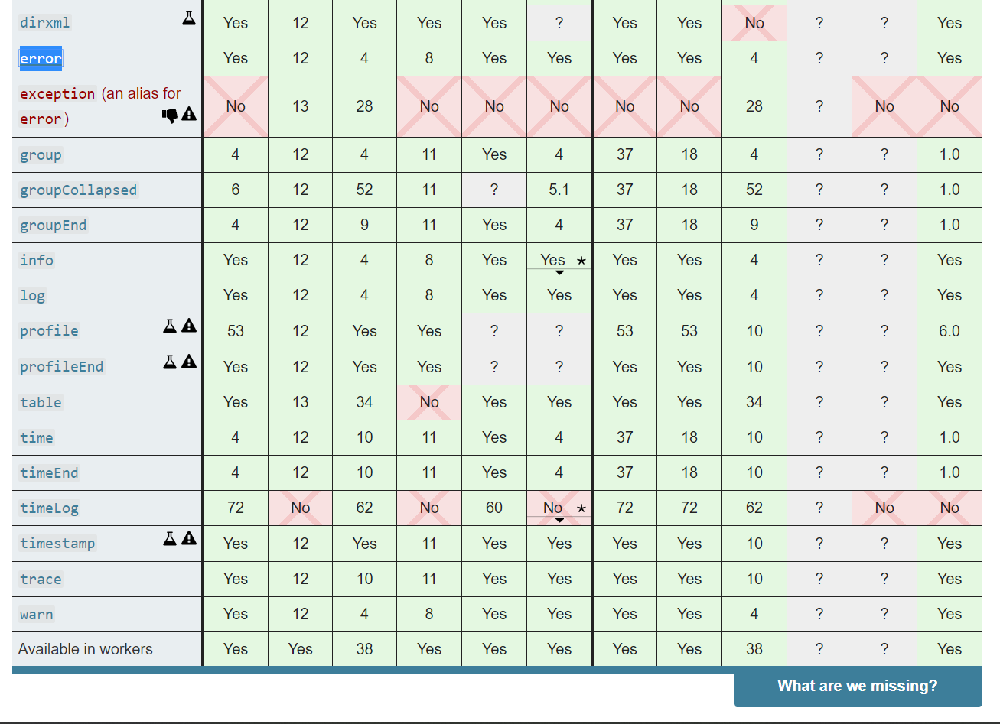

# Console.log debugging adventures

## Console logging is widely used in the web development, but it can also lead to issues in some areas. in this article we'll go over some aspects with logging and some of the alternatives to it

- Console Object
- Browser Compatibility
- Console logging in production
- Using a debugger with breakpoints
- Conclusion

## What is the Console Object?

The console object provides access to the browser's debugging console (e.g. the Web Console in Firefox). The specifics of how it works varies from browser to browser, but there is a de facto set of features that are typically provided.

The console object can be accessed from any global object. Window on browsing scopes and WorkerGlobalScope as specific variants in workers via the property console. It's exposed as Window.console, and can be referenced as simply console.

The console object has different methods like, (console.log, console.error, console.table, etc)

## Browser Compatibility

The different console methods don't all have support in the different browsers. Below is two images that shows the different browsers support.




As you can see not all methods is even available in some browsers, and can lead to your javascript not working completely.

Since version 8, Internet Explorer has its own console, like other browsers. However, if the console is not enabled, the console object does not exist and a call to console.log will throw an error.

## Logging in production

Logging in production code is generally a bad idea, and can lead to errors for your user, and even crash a site completely, in one case the browser does not support the method used, which

### How do i deactivate console.log in production?

One way is too simply condition it when logging, fx

```javascript
if (location.hostname === "localhost" || location.hostname === "127.0.0.1")
  console.log(someValue);
alert("It's a local server!");
```

Or you can keep the console object from blowing up with something like this

```javascript
if (!window.console || !console.firebug) {
  const names = [
    "debug",
    "info",
    "warn",
    "error",
    "assert",
    "dir",
    "dirxml",
    "group",
    "groupEnd",
    "time",
    "timeEnd",
    "count",
    "trace",
    "profile",
    "profileEnd"
  ];

  if (!window.console) window.console = {};
  if (!window.console.log) window.console["log"] = function() {};
  for (let i = 0; i < names.length; ++i)
    window.console[names[i]] = function() {};
}
```

## Using a debugger with breakpoints

The other way to debug an application, is to use a debugger with breakpoints. It's faster, less typing and generaly more reliable.

Setting breakpoints is vital to debugging effectively. A breakpoint is an intentional pause in a program, which allows the developer to inspect the internal state of the application at that moment. You can use it to view variables and perform other debugging functions.

It does take abit more time to set up properly and get running, but the upside can be a huge boon to your application, specially in large projects.

One way to debug your code is in the dev tools itself, you can even set breakpoints in your code with `debugger;`, or set them in the dev tool source code - You can read more in this link [Get started with debugging in Chrome Devtools](https://developers.google.com/web/tools/chrome-devtools/javascript)

Another way is to implement a custom debugger with fx this npm module [debug - npm](https://www.npmjs.com/package/debug)

## Conclusion

Console.log obviously can have some problems leading with it, and woulden't be ideal to use in large projects, but most web developers use it for their debugging adventures since you can code around it relatively easy while being fast to implement.

Thanks for reading & hope it helped!

Jonas & Andreas
